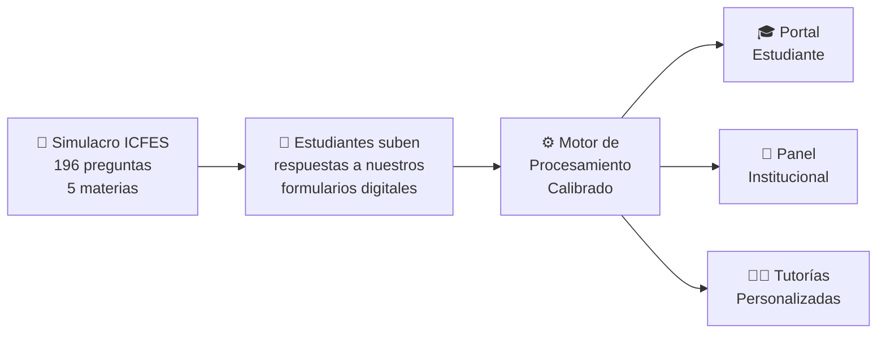
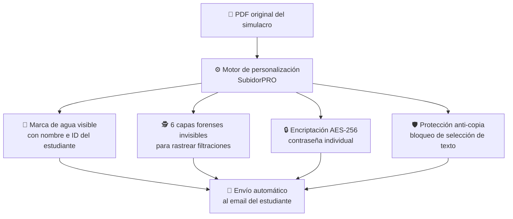
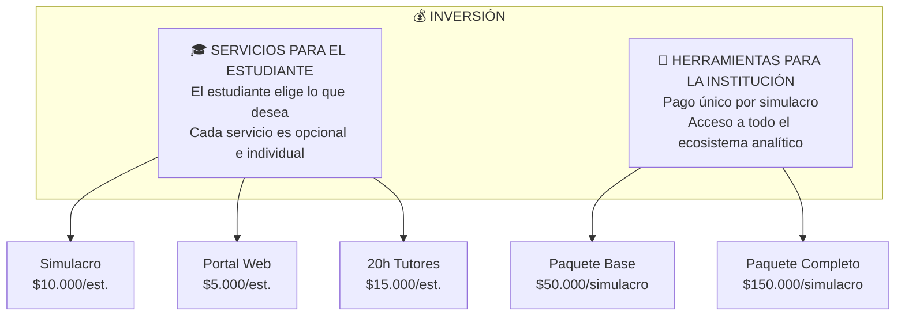
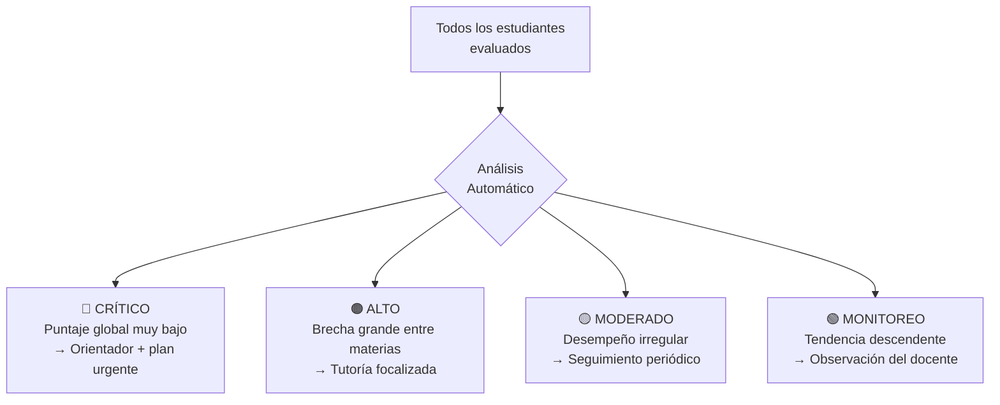
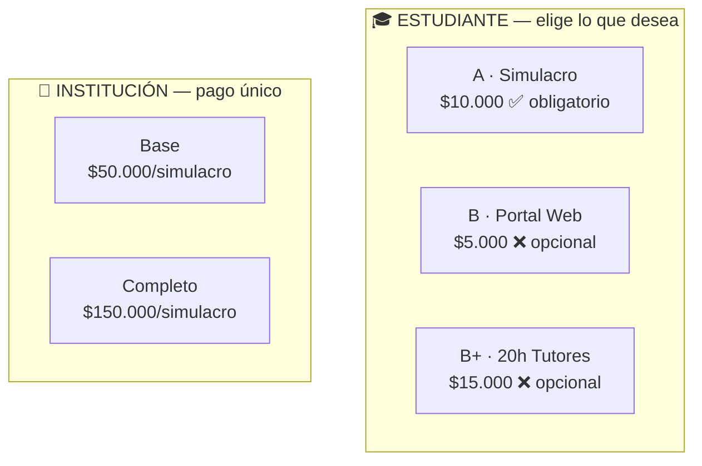

# Propuesta de Inversión Académica

## "Seamos Genios" — Inteligencia de Datos para el ICFES Saber 11

---

> **Más que un simulacro: un ecosistema de diagnóstico académico que transforma respuestas en decisiones.**

---

## ¿Qué ofrecemos?

Seamos Genios entrega a su institución un **simulacro ICFES Saber 11 completo** con un diferencial único: cada respuesta de cada estudiante se convierte en **datos accionables** para la toma de decisiones académicas.

### ¿Cómo funciona?

1. **La institución aplica el examen de forma presencial** en sus instalaciones, con el material que proporcionamos
2. **Cada estudiante sube sus respuestas** a nuestros formularios digitales desde cualquier dispositivo
3. **Nuestro motor de procesamiento calibrado** analiza las respuestas y genera resultados en un plazo de **1 día**
4. **Cada estudiante recibe por correo electrónico** su material personalizado con documentos protegidos y únicos
5. **Cada estudiante y la institución** acceden a sus resultados y herramientas en nuestra plataforma web 24/7

> Todo el análisis, soporte y seguimiento es **100% virtual**. La institución solo se encarga de la aplicación presencial del examen.

### 🔐 Documentos personalizados por estudiante

Cada estudiante recibe por **correo electrónico** sus documentos de forma completamente individualizada. No es un PDF genérico — cada archivo es **único e irrepetible**:

| Capa de protección | Qué hace |
| ------------------ | -------- |
| 🎨 **Marca de agua visible** | Nombre e ID del estudiante en mosaico sobre cada página (opacidad 20%, rotación 35°) |
| 🕵️ **Marcas forenses invisibles** | 6 capas de rastreo imperceptibles al ojo humano: micro-kerning tipográfico, caracteres Unicode zero-width, UUID único, checksum por página |
| 🔒 **Encriptación AES-256** | Cada PDF tiene contraseña individual. Permisos: imprimir ✅, copiar ❌, modificar ❌ |
| 🛡️ **Capa anti-copia** | Superposición invisible que bloquea la selección de texto sin afectar la lectura |
| 📋 **Metadatos únicos** | Título, licencia y hash SHA-256 individuales incrustados en el archivo |
| 🔥 **Rasterización** (opcional) | Modo de seguridad máxima: convierte el PDF a imágenes, haciendo las marcas imposibles de remover |

> [!IMPORTANT]
> **Si un estudiante filtra su PDF, las marcas forenses permiten identificar exactamente quién lo hizo.** Esto protege la inversión de la institución y el valor del material académico.

---

## Estructura de Inversión

La inversión se divide en **dos mundos independientes**: lo que paga el estudiante y lo que paga la institución.

---

## Servicios para el Estudiante (à la carte)

Cada estudiante **elige libremente** qué servicios adicionales desea. Nadie está obligado a tomar todo el paquete.

---

### A — Simulacro ICFES ($10.000/estudiante)

Este es el servicio base. Incluye:

- ✅ Examen tipo ICFES Saber 11 completo (196 preguntas, 5 materias, 2 sesiones)
- ✅ Material de examen para aplicación presencial por la institución
- ✅ Formulario digital para que cada estudiante suba sus respuestas
- ✅ Puntaje global ICFES (escala oficial 0–500) con fórmula calibrada
- ✅ Nivel de desempeño automático: Superior, Alto, Medio o En Desarrollo
- ✅ Documentos personalizados enviados por correo electrónico con protección forense y encriptación individual

> La institución aplica el examen en sus instalaciones. Cada estudiante sube sus respuestas a nuestros formularios digitales y recibe su material personalizado por email.

---

### B — Portal Web Personalizado ($5.000/estudiante) · *Opcional*

Acceso 24/7 a un portal web profesional con herramientas de análisis personal:

| Herramienta | Qué obtiene el estudiante |
| ----------- | ------------------------- |
| 📊 **Dashboard personal** | Puntaje global (0–500) + puntaje por materia (0–100) con nivel de desempeño |
| 🕸️ **Gráfico Radar** | Visualización inmediata de fortalezas y debilidades en las 5 materias |
| 🎯 **Insights por materia** | Recomendación automática de estudio: "Buen nivel, refuerza los detalles" o "Necesita refuerzo urgente" |
| 🇬🇧 **Nivel de Inglés CEFR** | Clasificación A- / A1 / A2 / B1 / B+ según Marco Común Europeo |
| 📝 **Análisis pregunta por pregunta** | Cada respuesta vs la correcta (✓/✗), con distribución del grupo |
| 🏆 **Ranking** | Posición global y por materia entre todos los participantes |
| 📈 **Evolución entre simulacros** | Si presenta más de un simulacro: "Subiste de 312 a 345 (+33 pts)" |
| 📱 **Acceso móvil** | Diseño responsive — funciona desde celular, tablet o computador |

> **$5.000** por 8 herramientas de análisis profesional. Es menos que el costo de imprimir y entregar resultados en papel.

---

### B+ — 20 Horas de Retroalimentación con Tutores ($15.000/estudiante) · *Opcional*

**El servicio premium para estudiantes que buscan el máximo provecho de su simulacro.**

Paquete de **20 horas de retroalimentación pregunta por pregunta** con los mejores tutores especializados en cada materia ICFES. 100% virtual (videollamada).

| Herramienta | Lo que incluye |
| ----------- | -------------- |
| 👨‍🏫 **20 horas de tutoría especializada** | Sesiones virtuales en vivo con tutores expertos en cada materia ICFES |
| 📝 **Revisión pregunta por pregunta** | El tutor revisa cada pregunta fallada: qué respondió, por qué es incorrecta, cuál es el razonamiento correcto |
| 🎯 **Plan de estudio personalizado** | Basado en las debilidades detectadas, el tutor diseña un plan de estudio a medida |
| 🧠 **Estrategias de resolución ICFES** | Técnicas para cada tipo de pregunta: eliminación de distractores, gestión de tiempo, lectura de enunciados |

**Las 20 horas se distribuyen según el desempeño individual del estudiante** en cada área, priorizando las materias donde más necesita refuerzo. La distribución es **personalizada y ajustable** — no hay una fórmula fija, se adapta 100% al perfil de cada alumno.

---

### Resumen de inversión del estudiante

El estudiante elige lo que desea. **Cada servicio es independiente:**

| Servicio | Costo | ¿Obligatorio? |
| -------- | ----- | -------------- |
| **A. Simulacro ICFES** | $10.000 | ✅ Sí (es el examen) |
| **B. Portal web** | $5.000 | ❌ Opcional |
| **B+. 20h con tutores** | $15.000 | ❌ Opcional |

**Combinaciones posibles:**

| Combinación | Total | Lo que recibe |
| ----------- | ----- | ------------- |
| Solo simulacro (A) | **$10.000** | Examen + puntaje global ICFES |
| Simulacro + portal (A+B) | **$15.000** | Examen + 8 herramientas web de análisis |
| Simulacro + tutores (A+B+) | **$25.000** | Examen + 20h de tutoría personalizada |
| Todo (A+B+B+) | **$30.000** | Examen + portal web + 20h de tutoría |

> [!TIP]
> El estudiante puede participar desde **$10.000** (solo simulacro) hasta **$30.000** (paquete completo). Cada quien decide según sus necesidades y posibilidades.

---

## Herramientas para la Institución (pago único por simulacro)

A diferencia de los servicios estudiantiles (que son individuales), las herramientas institucionales son un **pago único por simulacro** que le da acceso a la institución al ecosistema completo de análisis.

---

### Paquete Base — $50.000 por simulacro

Lo esencial para que la institución tenga visión general de sus resultados:

| Herramienta | Qué entrega a la institución |
| ----------- | ----------------------------- |
| 📊 **Dashboard analítico institucional** | Métricas clave: total evaluados, promedio global, puntaje máximo, desviación estándar |
| 🕸️ **Radar institucional** | Promedio por materia — dónde la institución es fuerte y dónde tiene oportunidades |
| 📈 **Estadísticas por materia** | Promedio, mediana, moda, mín/máx, desviación estándar para cada área ICFES |
| 🏅 **Distribución por niveles** | % de estudiantes en Superior, Alto, Medio y Bajo |

---

### Paquete Completo — $150.000 por simulacro

Todo lo del Paquete Base, más las herramientas avanzadas que transforman datos en decisiones:

#### 🔍 Auditoría de Preguntas Críticas

Identifica las preguntas más falladas con distribución de distractores. Le dice a la institución **qué temas reforzar con urgencia** sin adivinar.

**Ejemplo de lo que entrega (datos de un simulacro reciente con +300 estudiantes):**

| Materia | Pregunta | % Acierto | Lo que se detectó |
| ------- | -------- | --------- | ----------------- |
| Matemáticas | P2 | 30.3% | El distractor C (34%) superó a la respuesta correcta B (30%) — confusión conceptual masiva |
| Matemáticas | P32 | 46.3% | D (44%) casi empata con la correcta C (46%) — ambigüedad interpretativa |
| Matemáticas | P16 | 46.6% | Respuestas dispersas entre todos los distractores — fallo general de comprensión |

> [!NOTE]
> **Ejemplo real**: En un simulacro reciente, 8 de las 10 preguntas más falladas resultaron ser de Matemáticas. Esto le permitió a la institución focalizar su inversión en refuerzo en **una sola materia** en lugar de dispersar recursos en las cinco. Resultado: ahorro significativo en tutorías generales y mayor impacto pedagógico.

#### 🤝 Reunión Virtual de Fortalecimiento con Tutores

Sesión virtual con los docentes de la institución para:

- Interpretar los datos del simulacro en conjunto
- Identificar brechas de aprendizaje sistemáticas
- Diseñar acciones correctivas concretas con cronograma

#### 📋 Plan de Mejora Personalizado

Documento entregable con:

- Recomendaciones específicas por materia basadas en los datos reales
- Prioridades de intervención (cuáles temas atacar primero)
- Estrategias sugeridas de refuerzo adaptadas al contexto institucional

**Ejemplo de plan de mejora:**

| Prioridad | Hallazgo | Acción sugerida |
| --------- | -------- | --------------- |
| 🔴 Urgente | 69.7% de estudiantes fallan pregunta de interpretación gráfica | Taller virtual de 2h sobre trampas semánticas en gráficas |
| 🔴 Alta | Gran dispersión en Inglés entre niveles | Dividir refuerzo en 3 niveles: básico, intermedio, avanzado |
| 🟡 Media | Materias como Sociales muestran desempeño estable | Mantener metodología actual, monitorear en siguiente simulacro |

#### 🚨 Sistema de Alertas por Estudiante

Detección automática de estudiantes en riesgo con 4 niveles de severidad:

Cada alerta entrega: nombre, ID, puntaje global, **área más débil con puntaje exacto**, brecha entre su materia fuerte y débil, y **recomendación de acción**.

#### 🌍 Benchmark Nacional

Comparación de la institución contra promedios nacionales:

| Métrica | Su Institución | Promedio Nacional | Diferencia |
| ------- | -------------- | ----------------- | ---------- |
| Puntaje Global | 312 | 258 | **+54 pts** ✅ |
| % Superior+Alto | 46% | 28% | **+18%** ✅ |

> Estos datos son **argumentos de venta reales** para justificar la matrícula ante padres de familia y atraer nuevos estudiantes.

#### 📊 Análisis Comparativo entre Simulacros

Si la institución contrata más de un simulacro: evolución del promedio por materia, tendencias globales, progreso de estudiantes en alerta.

#### 🗺️ Plataforma Web de Mapeo y Seguimiento

Acceso web 24/7 para coordinadores con:

- Búsqueda por estudiante individual
- Filtros por materia, nivel de desempeño e institución
- Detalle de cada estudiante: todas sus respuestas, patrones detectados, comparación con el grupo
- Exportación de datos a CSV/Excel para Comité Académico y Plan de Mejoramiento Institucional

#### 🎯 Consultoría Virtual Personalizada

Sesión de análisis profundo con asesor de Seamos Genios para diseñar estrategias institucionales a medida basadas en los datos.

---

### Resumen: Herramientas Institucionales

| Paquete | Inversión | Lo que incluye |
| ------- | --------- | -------------- |
| **Base** | **$50.000** / simulacro | Dashboard analítico + estadísticas + radar + distribución por niveles |
| **Completo** | **$150.000** / simulacro | Todo lo Base + auditoría de preguntas + reunión con tutores + plan de mejora + alertas + benchmark + plataforma de seguimiento + consultoría + exportables |

> [!IMPORTANT]
> El pago institucional es **único por simulacro**, no por estudiante. Esto significa que una institución con 50 o con 300 estudiantes paga lo mismo: **$150.000** para acceder al paquete completo de herramientas analíticas.

---

## Resumen General de Inversión

| ¿Quién paga? | Servicio | Costo | Tipo de pago |
| ------------- | -------- | ----- | ------------ |
| 🎓 Estudiante | Simulacro ICFES | $10.000 | Por estudiante |
| 🎓 Estudiante | Portal web (opcional) | $5.000 | Por estudiante |
| 🎓 Estudiante | 20h tutores (opcional) | $15.000 | Por estudiante |
| 🏫 Institución | Paquete Base | $50.000 | **Único por simulacro** |
| 🏫 Institución | Paquete Completo | $150.000 | **Único por simulacro** |

---

## ¿Por qué Seamos Genios y no otro Pre-ICFES?

| Característica | Seamos Genios | Pre-ICFES tradicional |
| -------------- | ------------- | --------------------- |
| Simulacro ICFES completo | ✅ | ✅ |
| Puntaje global calibrado | ✅ | ✅ |
| Portal web individual por estudiante | ✅ | ❌ PDF estático |
| Ranking por materia | ✅ | ❌ |
| Análisis pregunta por pregunta | ✅ | ❌ |
| Mapa de distractores | ✅ | ❌ |
| Dashboard analítico institucional | ✅ | ❌ |
| Reunión virtual con tutores | ✅ | ❌ |
| 20h retroalimentación personalizada | ✅ (opcional) | ❌ |
| Alertas automáticas por estudiante | ✅ | ❌ |
| Benchmark nacional | ✅ | ❌ |
| Plataforma de seguimiento 24/7 | ✅ | ❌ |
| Reportes exportables (CSV/Excel) | ✅ | ❌ |
| Multi-simulacro con tendencias | ✅ | ❌ |
| Calibración por dificultad de pregunta | ✅ | ❌ |
| Todo 100% virtual (excepto aplicación) | ✅ | ❌ |

---

## Beneficios Administrativos

| Beneficio | Detalle |
| --------- | ------- |
| 📊 **Facturación transparente** | Servicios estudiantiles (A, B, B+) e institucionales (Base/Completo) facturados por separado |
| 🎓 **Libertad del estudiante** | Cada alumno elige qué servicios adicionales desea sin obligación |
| 🏫 **Costo fijo institucional** | Pago único por simulacro, sin importar la cantidad de estudiantes |
| 💻 **Activo digital permanente** | La plataforma queda activa con el histórico de todos los simulacros |
| 📋 **Insumo para PIAR/PMI** | Datos para el Plan Individual de Ajustes Razonables y Plan de Mejoramiento Institucional |
| 🏆 **Marketing institucional** | Benchmark verificable para atraer nuevos estudiantes y justificar matrícula |
| 🔒 **Seguridad de datos** | Infraestructura Google (Firebase). Cada estudiante solo ve sus propios datos |
| 🌐 **100% virtual** | Soporte, análisis, tutorías y seguimiento completamente virtuales |

---

> **Cada peso invertido está respaldado por un dato auditable y una acción pedagógica concreta.**

*Seamos Genios Colombia · 2026*
