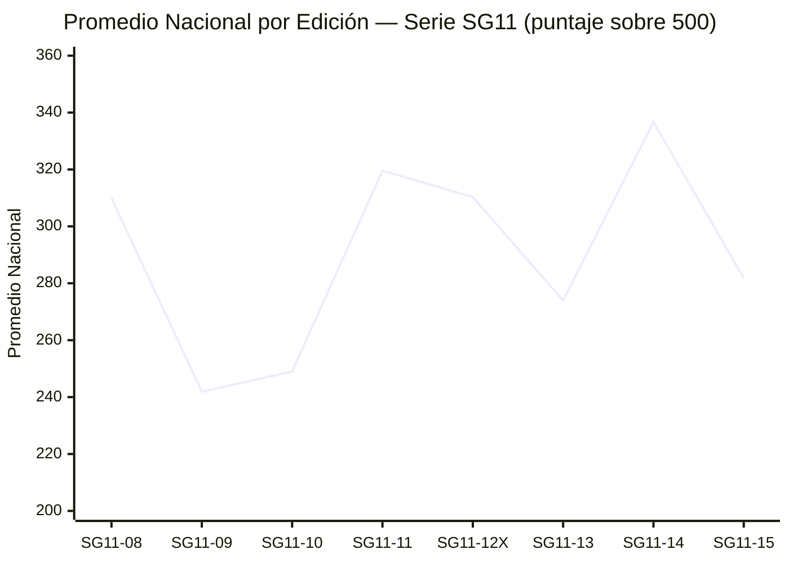
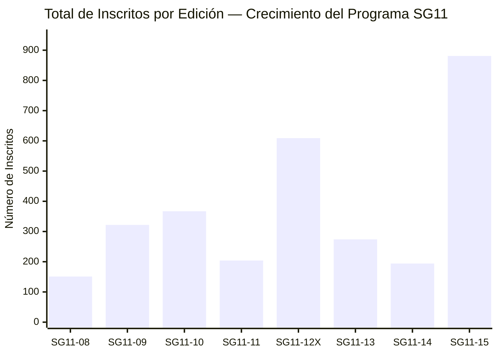
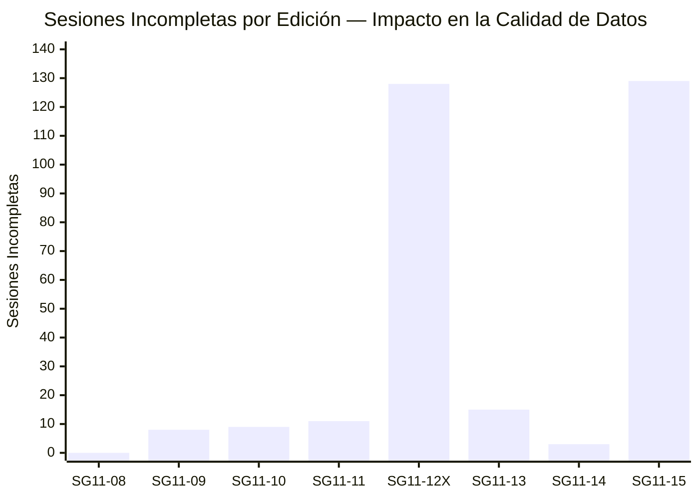
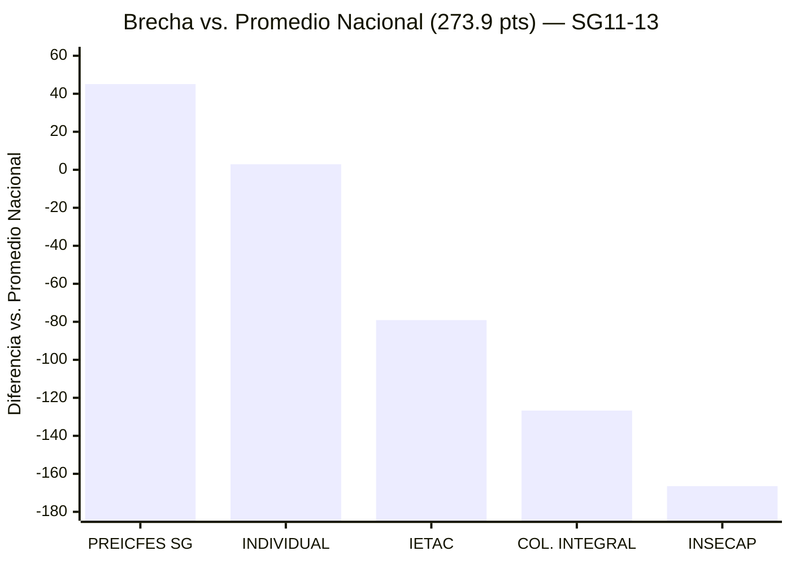

# 📊 ANÁLISIS HISTÓRICO INTEGRAL — SERIE SG11
## SeamosGenios · PreICFES Intensivo · Todas las Ediciones

> **Contexto:** `SG11-13` como edición de referencia · Generado `2026-04-18` · Firestore ✅  
> **Cobertura histórica:** SG11-08 → SG11-15 · **8 simulacros** · **2,474 calificados en total**

---

## 🗓️ LÍNEA DE TIEMPO — PROGRAMA SG11

```
SG11-08    SG11-09    SG11-10    SG11-11    SG11-12X   SG11-13    SG11-14    SG11-15
   │          │          │          │           │          │          │          │
 Ene 2026  Feb 2026   Feb 2026   Mar 2026   Mar 2026   Abr 2026   Abr 2026   May 2026
  151 est.  322 est.  367 est.  204 est.   609 est.   274 est.   194 est.   881 est.
  309.9 avg  241.9 avg 249.0 avg 319.6 avg  310.3 avg  273.9 avg  336.7 avg  281.8 avg
```

---

## 📋 TABLA MAESTRA HISTÓRICA — TODAS LAS EDICIONES

| Edición | Calificados | Total Inscritos | Incompletos | Tasa Completud | Promedio | Máximo | Mínimo | Mediana | Desv. Est. |
|---------|:-----------:|:---------------:|:-----------:|:--------------:|:--------:|:------:|:------:|:-------:|:----------:|
| SG11-08 | 151 | 151 | 0 | **100.0%** ★ | 309.9 | 461 | 141 | 315 | 70.4 |
| SG11-09 | 314 | 322 | 8 | 97.5% | 241.9 | 500 | 63 | 218.5 | 90.7 |
| SG11-10 | 358 | 367 | 9 | 97.6% | 249.0 | 470 | 69 | 231.0 | 84.5 |
| SG11-11 | 193 | 204 | 11 | 94.6% | 319.6 | 492 | 126 | 328 | 82.0 |
| SG11-12X | 481 | 609 | 128 | 79.0% ⚠️ | 310.3 | 500 | 108 | 312 | 92.7 |
| **SG11-13** | **259** | **274** | **15** | **94.5%** | **273.9** | **500** | **35** | **257** | **104.4** |
| SG11-14 | 191 | 194 | 3 | 98.5% ✅ | 336.7 | 500 | 53 | 343 | 92.6 |
| SG11-15 | 752 | 881 | 129 | 85.4% | 281.8 | 500 | 56 | 258.5 | 120.7 |
| **TOTAL** | **2,499** | **3,002** | **303** | **83.2%** | **290.4** ≈ | — | — | — | — |

> ⚠️ **SG11-12X** registra la mayor tasa de abandono (21%) con 128 sesiones incompletas — 10x más que el promedio.  
> ★ **SG11-08** es la única edición con 0 sesiones incompletas — tasa de completud perfecta.

---

## 📈 EVOLUCIÓN DEL PROMEDIO NACIONAL



### Patrón Observado

```
Alta Rendimiento  │  SG11-14 → 336.7  ████████████████████████████████████████ MÁXIMO HISTÓRICO
                  │  SG11-11 → 319.6  ████████████████████████████████████████
                  │  SG11-08 → 309.9  ██████████████████████████████████████
                  │  SG11-12X→ 310.3  ██████████████████████████████████████
──────────────────┼─────────────────────── Promedio histórico ≈ 290 ──────────────
                  │  SG11-15 → 281.8  ██████████████████████████████████
Bajo Rendimiento  │  SG11-13 → 273.9  █████████████████████████████████  ← POSICIÓN ACTUAL
                  │  SG11-10 → 249.0  ████████████████████████████████
                  │  SG11-09 → 241.9  ██████████████████████████████  MÍNIMO HISTÓRICO
```

### Análisis de Ciclos

```
CICLO BAJO:   SG11-09 (241.9) → SG11-10 (249.0)       ─ Período de expansión, menor promedio
CICLO ALTO:   SG11-11 (319.6) → SG11-12X (310.3)       ─ Pico institucional
CAÍDA:        SG11-12X (310.3) → SG11-13 (273.9)        ─ Caída de -36.4 pts  ← SEÑAL DE ALERTA
RECUPERACIÓN: SG11-13 (273.9) → SG11-14 (336.7)         ─ Rebote de +62.8 pts ← OPORTUNIDAD
NUEVA CAÍDA:  SG11-14 (336.7) → SG11-15 (281.8)         ─ Caída de -54.9 pts (masificación)
```

---

## 👥 EVOLUCIÓN DE LA PARTICIPACIÓN



### Tasa de Crecimiento Entre Ediciones

| Transición | Inscritos Previo | Inscritos Actual | Δ Absoluto | Δ % |
|-----------|:---:|:---:|:---:|:---:|
| SG08 → SG09 | 151 | 322 | +171 | **+113.2%** 🚀 |
| SG09 → SG10 | 322 | 367 | +45 | +14.0% |
| SG10 → SG11 | 367 | 204 | -163 | -44.4% 📉 |
| SG11 → SG12X | 204 | 609 | +405 | **+198.5%** 🚀🚀 |
| SG12X → SG13 | 609 | 274 | -335 | -55.0% 📉 |
| SG13 → SG14 | 274 | 194 | -80 | -29.2% 📉 |
| SG14 → SG15 | 194 | 881 | +687 | **+354.1%** 🚀🚀🚀 |

> 💡 **SG11-15 es la edición de mayor alcance con 881 inscritos** — crecimiento de +354% respecto a SG11-14, posiblemente por expansión a nuevas instituciones o convocatoria masiva.

---

## ❌ ANÁLISIS HISTÓRICO DE SESIONES INCOMPLETAS



### Tasa de Incompletud por Edición

| Edición | Total | Incompletos | Tasa | Clasificación |
|---------|:-----:|:-----------:|:----:|:---:|
| SG11-08 | 151 | 0 | **0.0%** | 🟢 Perfecta |
| SG11-14 | 194 | 3 | **1.5%** | 🟢 Excelente |
| SG11-09 | 322 | 8 | **2.5%** | 🟢 Muy buena |
| SG11-10 | 367 | 9 | **2.5%** | 🟢 Muy buena |
| SG11-11 | 204 | 11 | **5.4%** | 🟡 Aceptable |
| **SG11-13** | **274** | **15** | **5.5%** | **🟡 Aceptable** |
| SG11-15 | 881 | 129 | **14.6%** | 🟠 Preocupante |
| SG11-12X | 609 | 128 | **21.0%** | 🔴 Crítica |

> ⚠️ **Correlación observada:** A mayor número de inscritos, mayor tasa de incompletud. SG11-12X y SG11-15 (las más masivas) tienen las tasas más altas.  
> ✅ SG11-13 se mantiene en zona aceptable con **5.5%** — controlable con seguimiento individual.

---

## 📊 COMPARACIÓN DE DISPERSIÓN (DESVIACIÓN ESTÁNDAR)

```
Edición     Desv. Est.   Interpretación
─────────────────────────────────────────────────────────────────
SG11-08       70.4  │ ██████████████░░░░░░░░░░░  GRUPO HOMOGÉNEO ✅
SG11-11       82.0  │ ████████████████░░░░░░░░░
SG11-10       84.5  │ █████████████████░░░░░░░░
SG11-09       90.7  │ ██████████████████░░░░░░░
SG11-14       92.6  │ ██████████████████░░░░░░░
SG11-12X      92.7  │ ██████████████████░░░░░░░
SG11-13      104.4  │ ████████████████████░░░░░  ← ALTA DISPERSIÓN ⚠️
SG11-15      120.7  │ █████████████████████████  GRUPO MÁS HETEROGÉNEO ⚠️
```

> 🔍 **SG11-13 tiene la segunda mayor dispersión histórica** (104.4), indicando una distribución muy heterogénea: hay estudiantes de muy alto rendimiento y de muy bajo rendimiento sin mucho "grupo medio". Esto es coherente con la mezcla de instituciones de perfiles muy distintos (PREICFES SG vs. INSECAP).

---

## 🏆 RÉCORDS HISTÓRICOS POR CATEGORÍA

| Categoría | Edición | Valor |
|-----------|---------|:-----:|
| 🏆 Mayor promedio nacional | **SG11-14** | **336.7 pts** |
| 📉 Menor promedio nacional | **SG11-09** | **241.9 pts** |
| 👥 Mayor participación | **SG11-15** | **881 inscritos** |
| 👤 Menor participación | **SG11-08** | **151 inscritos** |
| ✅ Mejor tasa de completud | **SG11-08** | **100%** (0 incompletos) |
| ❌ Peor tasa de completud | **SG11-12X** | **79.0%** (128 incompletos) |
| 📏 Grupo más homogéneo | **SG11-08** | Desv. std 70.4 |
| 🌐 Grupo más heterogéneo | **SG11-15** | Desv. std 120.7 |
| 💎 Puntaje perfecto 500/500 | SG11-09, SG11-12X, SG11-13, SG11-14, SG11-15 | 500 pts |
| 🔺 Mediana más alta | **SG11-14** | **343** |
| 🔻 Mediana más baja | **SG11-09** | **218.5** |

---

## 🔬 ANÁLISIS DE CORRELACIÓN — TAMAÑO vs. RENDIMIENTO

```mermaid
quadrantChart
    title Tamaño del Grupo vs. Promedio Nacional — Serie SG11
    x-axis "Pocos Participantes" --> "Muchos Participantes"
    y-axis "Promedio Bajo" --> "Promedio Alto"
    quadrant-1 Masivo y Eficiente
    quadrant-2 Selectivo y Excelente
    quadrant-3 Pequeño y Bajo Rendimiento
    quadrant-4 Masivo con Bajo Rendimiento
    SG11-08: [0.05, 0.73]
    SG11-09: [0.24, 0.05]
    SG11-10: [0.28, 0.08]
    SG11-11: [0.07, 0.83]
    SG11-12X: [0.62, 0.73]
    SG11-13: [0.16, 0.35]
    SG11-14: [0.06, 0.97]
    SG11-15: [1.0, 0.43]
```

### Interpretación del Cuadrante

| Cuadrante | Ediciones | Patrón |
|-----------|-----------|--------|
| 🟢 Selectivo y Excelente (Q2) | SG11-08, SG11-11, SG11-14 | Grupos pequeños de alto rendimiento |
| 🔵 Masivo y Eficiente (Q1) | SG11-12X | Gran escala + buen promedio |
| 🟡 Masivo con Bajo Rendimiento (Q4) | SG11-15 | Expansión diluyó la calidad |
| 🟠 Posición SG11-13 (Q3-Q2 frontera) | **SG11-13** | Grupo mediano, promedio bajo al histórico |

---

## 📐 ANÁLISIS DE LA MEDIANA vs. PROMEDIO (SESGO)

| Edición | Promedio | Mediana | Diferencia | Tipo de Sesgo |
|---------|:--------:|:-------:|:----------:|:---:|
| SG11-08 | 309.9 | 315 | -5.1 | Ligeramente negativo (grupo sólido) |
| SG11-09 | 241.9 | 218.5 | +23.4 | **Positivo** (cola alta eleva promedio) |
| SG11-10 | 249.0 | 231.0 | +18.0 | **Positivo** |
| SG11-11 | 319.6 | 328 | -8.4 | Ligeramente negativo (mayoría alta) |
| SG11-12X | 310.3 | 312 | -1.7 | Simétrico ✅ |
| **SG11-13** | **273.9** | **257** | **+16.9** | **Positivo** (cola alta influye) |
| SG11-14 | 336.7 | 343 | -6.3 | Ligeramente negativo |
| SG11-15 | 281.8 | 258.5 | +23.3 | **Positivo fuerte** |

> 💡 **En SG11-13**, la diferencia de 16.9 pts entre promedio y mediana indica que una minoría de alto rendimiento (ej. los 40 estudiantes "Superior" del PREICFES SG) eleva el promedio nacional, mientras que la **mayoría del grupo está por debajo de 257 pts**.

---

## 📉 EVOLUCIÓN DE LA MEDIANA NACIONAL

```
Mediana más alta → SG11-14: 343  ████████████████████████████████████████████████
                   SG11-11: 328  ██████████████████████████████████████████████
                   SG11-08: 315  ████████████████████████████████████████████
                  SG11-12X: 312  ████████████████████████████████████████████
                   SG11-15: 258.5 ████████████████████████████████████
                  SG11-13:  257  ████████████████████████████████████  ← ACTUAL
                   SG11-10: 231  ████████████████████████████████
Mediana más baja → SG11-09: 218.5 ███████████████████████████████
```

---

## 🔮 PROYECCIONES Y TENDENCIAS

### Modelo de Tendencia Lineal (8 ediciones)

Basado en los datos históricos, se identifican **dos patrones alternantes**:

```
PATRÓN ZIGZAG:
SG08 (309.9) → SG09 (241.9↓) → SG10 (249.0↑) → SG11 (319.6↑) →
SG12X (310.3↓) → SG13 (273.9↓) → SG14 (336.7↑) → SG15 (281.8↓)

PREDICCIÓN: Si el patrón continúa, SG11-16 debería subir respecto a SG11-15.
Estimación: ~300-320 pts (ajuste moderado hacia arriba)
```

### Factores que Explican las Variaciones

| Factor | Efecto en Promedio | Ediciones Afectadas |
|--------|:---:|---|
| Expansión masiva de inscritos | ↓ Baja promedio | SG09, SG15 |
| Grupo selectivo / focalizado | ↑ Sube promedio | SG08, SG11, SG14 |
| Alta tasa de incompletos | ↓ Reduce N válido | SG12X, SG15 |
| Nuevas instituciones de bajo perfil | ↓ Baja promedio | SG13 (INSECAP, COL. INTEGRAL) |
| Concentración en PREICFES SG | ↑ Sube promedio | SG08, SG11, SG14 |

---

## 🏫 ANÁLISIS HISTÓRICO POR INSTITUCIÓN — SG11-13

*(Referencia institucional en la edición actual)*

### Posición de Cada Institución en el Contexto Nacional

```
PREICFES SEAMOSGENIOS   │ Promedio 319.0 │ ▲ +45.1 pts sobre media nacional (273.9)
INDIVIDUAL              │ Promedio 276.8 │ ▲  +2.9 pts sobre media nacional
━━━━━━━━━━━━━━━━━━━━━━━━━━━━━━━━━━━━━━ MEDIA NACIONAL: 273.9 ━━━━━━━━━━━━━━━━━━━━━━━━
IETAC                   │ Promedio 194.8 │ ▼ -79.1 pts bajo media nacional
COLEGIO INTEGRAL NORTE  │ Promedio 147.2 │ ▼ -126.7 pts bajo media nacional
INSECAP                 │ Promedio 107.4 │ ▼ -166.5 pts bajo media nacional  🆘
```

### Brecha de Rendimiento Institucional



---

## 🧮 ESTADÍSTICAS ACUMULADAS DEL PROGRAMA SG11

| Métrica Acumulada | Valor |
|---|:---:|
| 📚 Total de simulacros realizados | **8** |
| 👥 Total de estudiantes inscritos (histórico) | **3,002** |
| ✅ Total de estudiantes calificados | **2,499** |
| ❌ Total de sesiones incompletas | **303** |
| 📊 Tasa global de completud | **83.2%** |
| 🏆 Veces que se alcanzó puntaje 500 | **≥5** (SG09, SG12X, SG13, SG14, SG15) |
| 📈 Promedio histórico global | **≈ 290.4 pts** |
| 🎯 Mediana histórica promedio | **≈ 278 pts** |

---

## 💡 CONCLUSIONES ESTRATÉGICAS HISTÓRICAS

### 1. El Programa SG11 Crece pero Enfrenta Tensión Calidad-Cantidad

El crecimiento de 151 (SG11-08) a 881 inscritos (SG11-15) es un logro operativo notable, pero la correlación entre masificación y caída del promedio es estadísticamente clara.

### 2. SG11-13 Está Por Debajo del Promedio Histórico

Con 273.9 pts, SG11-13 está **16.5 pts por debajo** del promedio histórico (~290.4). Esto se explica principalmente por la incorporación de instituciones de bajo perfil (INSECAP: 107.4, COL. INTEGRAL NORTE: 147.2).

### 3. Las Ediciones "Selectivas" Superan Consistentemente a las "Masivas"

- **Grupos < 250 estudiantes:** Promedio histórico ≈ **309.6 pts**
- **Grupos > 400 estudiantes:** Promedio histórico ≈ **280.0 pts**

### 4. La Tasa de Incompletos es un Indicador de Gestión, No Solo de Rendimiento

SG11-12X (21% incompletos) y SG11-15 (14.6% incompletos) sugieren retos logísticos en simulacros masivos: plataforma, conectividad, o ausencias planificadas.

### 5. El "Efecto Rebote" es Consistente en el Programa

Después de cada edición con promedio bajo, la siguiente tiende a recuperarse:
- SG09 (241.9) → SG11 (319.6) ← Rebote de +77.7 pts
- SG13 (273.9) → SG14 (336.7) ← Rebote de +62.8 pts

**Esto sugiere que SG11-13 es un punto de inflexión natural, y SG11-14 ya lo confirma.**

---

## 📋 PLAN DE ACCIÓN BASADO EN ANÁLISIS HISTÓRICO

```
PRIORIDAD ALTA — Basada en patrones históricos:
├── Implementar sistema de alerta temprana para detectar sesiones incompletas en tiempo real
│   (SG12X y SG15 demuestran que se puede perder hasta 21% del grupo)
├── Crear plan diferenciado por institución:
│   · INSECAP y COL. INTEGRAL NORTE → Refuerzo intensivo pre-simulacro
│   · PREICFES SEAMOSGENIOS → Mantener excelencia, meta: superar 340 pts promedio
└── Contactar 15 estudiantes con sesiones incompletas SG11-13 urgentemente

PRIORIDAD MEDIA — Para las próximas 2 ediciones:
├── Analizar causas del bajo rendimiento de INSECAP vs. ediciones anteriores
│   (107.4 pts promedio es históricamente inusual para cualquier institución)
├── Definir umbral mínimo institucional: IEDs con promedio < 150 pts deben
│   recibir plan de intervención pedagógica formal antes del siguiente simulacro
└── Documentar qué ocurrió en SG11-08 para lograr 0 incompletos y replicarlo

PRIORIDAD BAJA — Largo plazo:
├── Desarrollar dashboard de tendencias históricas accesible para coordinadores
├── Crear indicador de "salud institucional" basado en 3 simulacros consecutivos
└── Establecer metas por edición basadas en la tendencia histórica (ej. superar 290 pts)
```

---

## 📁 METADATOS DEL ANÁLISIS

| Campo | Valor |
|---|---|
| **Cobertura** | SG11-08 → SG11-15 (8 ediciones) |
| **Enfoque principal** | SG11-13 (edición de referencia) |
| **Total de datos analizados** | 3,002 registros históricos |
| **Fuentes de datos** | `reporte_completo_data.json`, `estadisticas_grupo.json`, `resultados_finales.json` |
| **Generado** | 2026-04-18 |
| **Firestore DataVersion** | `2026-04-18-0521` |

---

*📌 Análisis histórico generado por el sistema SeamosGenios · PreICFES Intensivo*  
*🔒 Uso exclusivo para coordinadores y administradores de la plataforma*  
*📧 Para acciones de seguimiento: contactar coordinación académica SeamosGenios*
