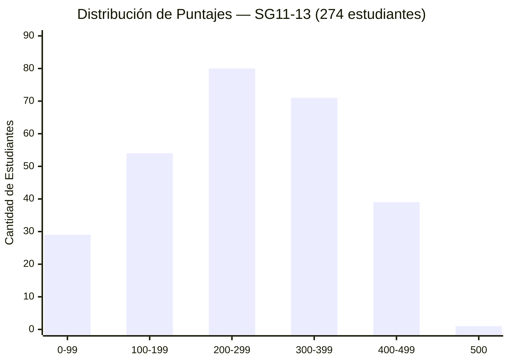
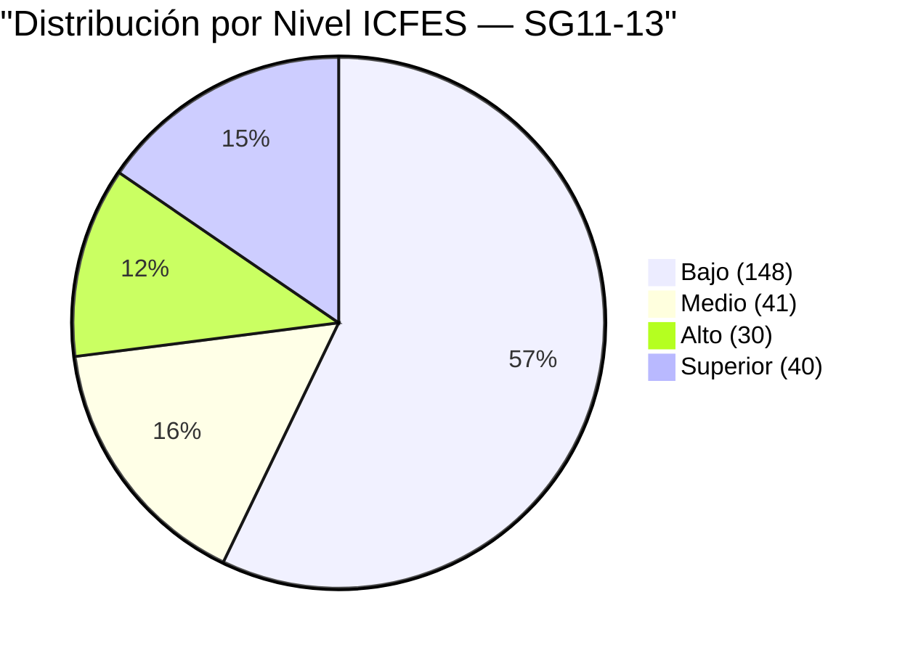
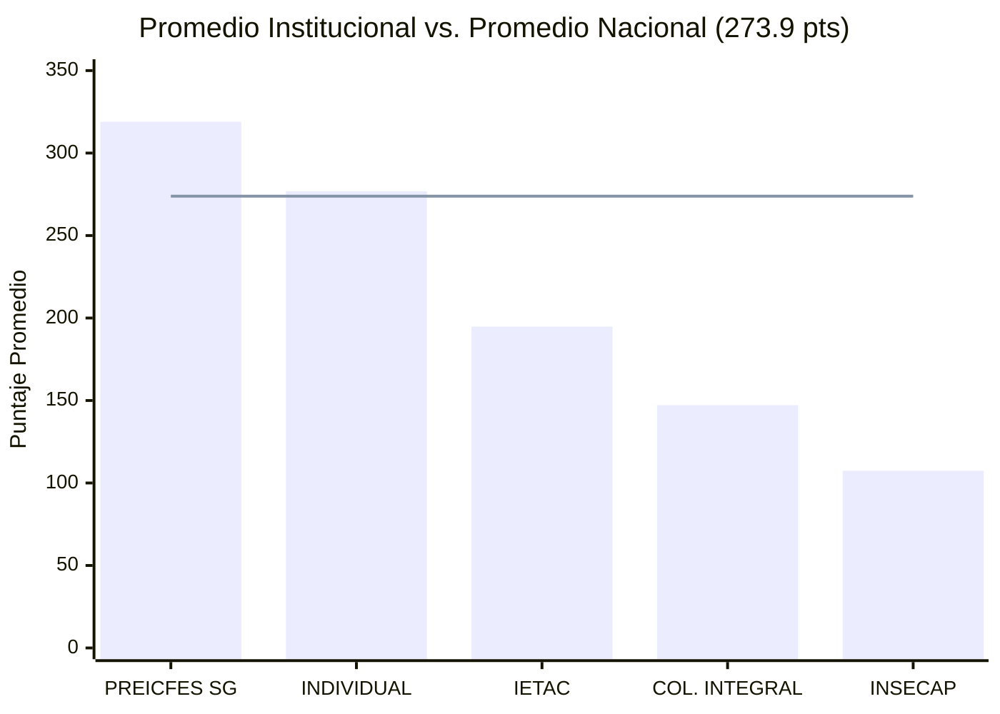
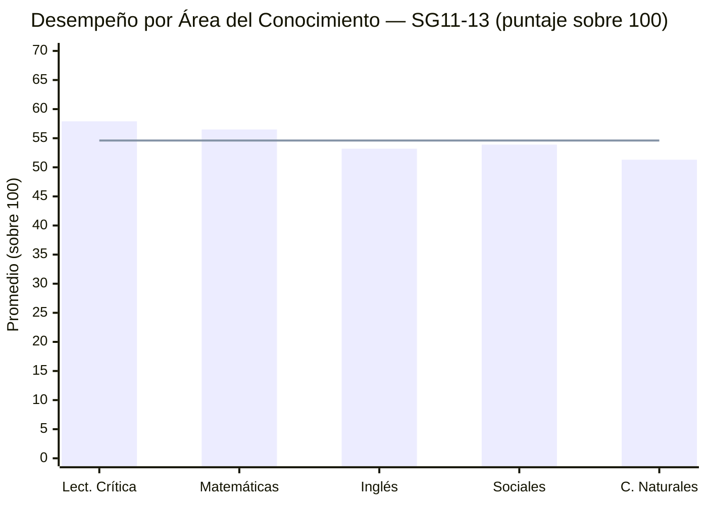
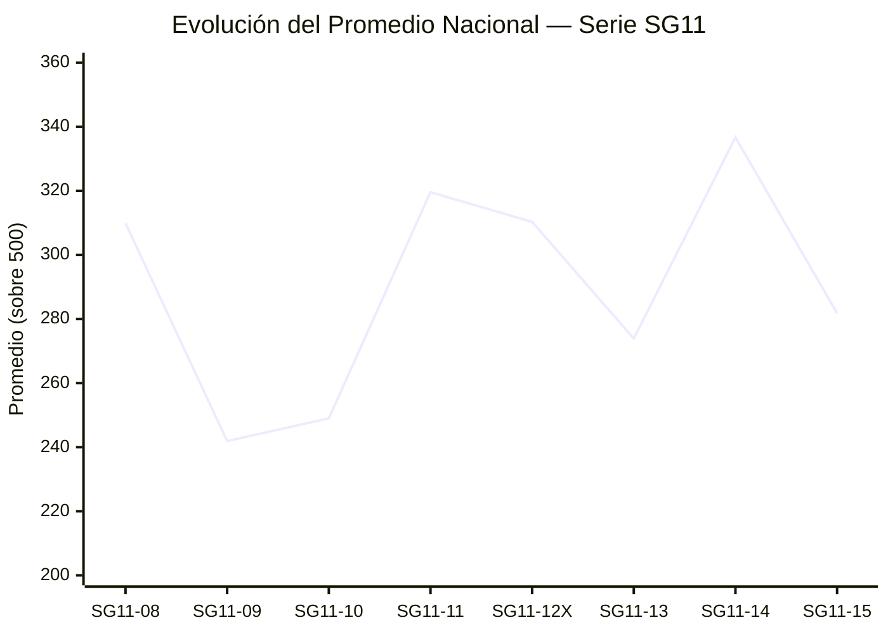
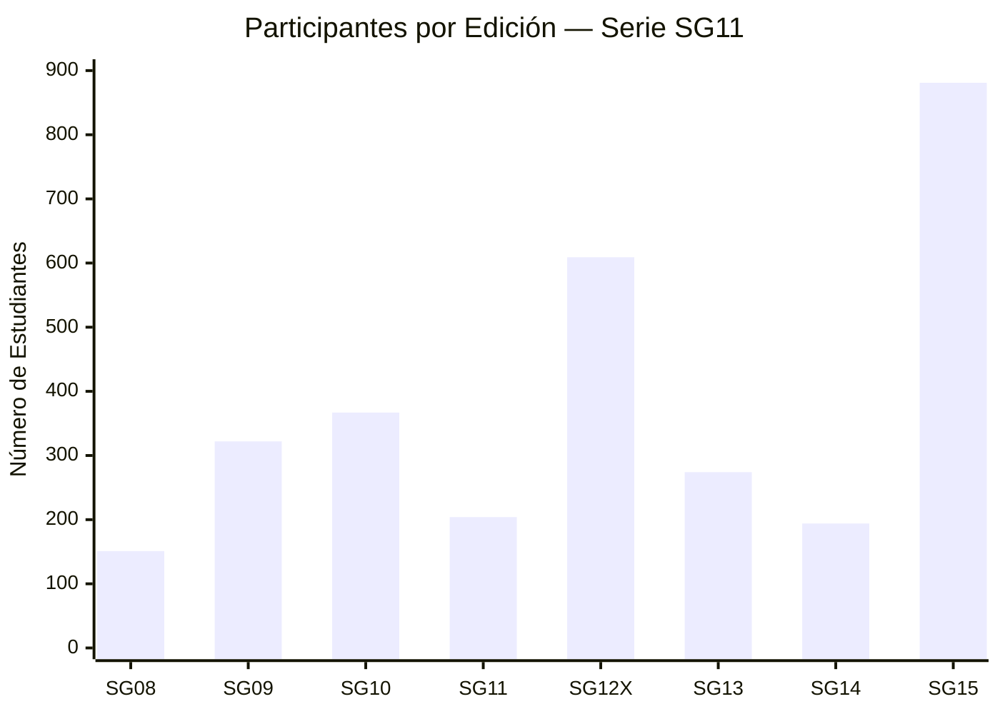

# 📊 REPORTE ANALÍTICO DETALLADO — SIMULACRO SG11-13
### SeamosGenios · PreICFES Intensivo · Edición 2026

> **Generado:** `2026-04-18` | **DataVersion:** `2026-04-18-0521` | **Estado Firestore:** ✅ Sincronizado

---

## 🎯 RESUMEN EJECUTIVO

```
╔══════════════════════════════════════════════════════════════════╗
║          SIMULACRO NACIONAL SG11-13 · RESULTADOS FINALES        ║
╠══════════════════════════════════════════════════════════════════╣
║  👥 Participantes Totales    │  274  estudiantes                 ║
║  ✅ Calificados              │  259  (94.5%)                     ║
║  ❌ Sesiones Incompletas     │   15  (5.5%)                      ║
║  📈 Promedio Nacional        │  273.9 / 500  pts                 ║
║  🏆 Puntaje Máximo           │  500  pts  (1 estudiante)         ║
║  📉 Puntaje Mínimo           │   35  pts                         ║
║  📊 Mediana                  │  257  pts                         ║
║  〰️ Desviación Estándar      │  104.4  pts                       ║
║  🏫 Instituciones            │    5                              ║
╚══════════════════════════════════════════════════════════════════╝
```

> 💡 **Insight clave:** La mediana (257) está significativamente por debajo del promedio (273.9), indicando una distribución **asimétrica positiva** — hay un grupo de alto rendimiento que eleva el promedio nacional.

---

## 📐 DISTRIBUCIÓN POR RANGOS DE PUNTAJE

### Histograma de Frecuencia

```
Puntaje      │ Estudiantes │ Distribución Visual
─────────────┼─────────────┼────────────────────────────────────────
  0 –  99    │     29      │ ████████░░░░░░░░░░░░░░░░░░░░░  11.2%
100 – 199    │     54      │ ████████████████░░░░░░░░░░░░░  20.8%
200 – 299    │     80      │ ███████████████████████░░░░░░  30.9%  ← MODA
300 – 399    │     71      │ █████████████████████░░░░░░░░  27.4%
400 – 499    │     39      │ ████████████░░░░░░░░░░░░░░░░░  15.1%
    500      │      1      │ █░░░░░░░░░░░░░░░░░░░░░░░░░░░░   0.4%  ← PUNTAJE PERFECTO
─────────────┼─────────────┼────────────────────────────────────────
  TOTAL      │    274      │
```

### Diagrama Mermaid — Distribución por Rangos



---

## 🏅 CLASIFICACIÓN POR NIVEL DE DESEMPEÑO (Escala ICFES)

| Nivel | Rango | Estudiantes | % del Total | Tendencia |
|-------|-------|:-----------:|:-----------:|-----------|
| 🔴 **Bajo** | 0 – 249 pts | **148** | **57.1%** | ↑ Requiere intervención |
| 🟡 **Medio** | 250 – 349 pts | **41** | **15.8%** | → Zona de desarrollo |
| 🟢 **Alto** | 350 – 449 pts | **30** | **11.6%** | ↑ Sólido desempeño |
| 🏆 **Superior** | 450 – 500 pts | **40** | **15.4%** | ★ Excelencia académica |

> ⚠️ **Alerta:** El **57.1%** de los estudiantes se encuentra en nivel Bajo. Esto representa una oportunidad crítica de intervención pedagógica antes del ICFES real.

### Diagrama Mermaid — Niveles ICFES



---

## 🏫 ANÁLISIS POR INSTITUCIÓN EDUCATIVA

### Tabla Comparativa Institucional

| Institución | Participantes | Calificados | Incompletos | Promedio | Máximo | Mínimo | Mediana | Desv. Est. |
|-------------|:---:|:---:|:---:|:---:|:---:|:---:|:---:|:---:|
| 🥇 **PREICFES SEAMOSGENIOS** | 101 | 99 | 2 | **319.0** | 500 | 64 | 327 | 98.0 |
| 🥈 **INDIVIDUAL (Proyecto Sec.)** | 116 | 113 | 3 | **276.8** | 477 | 35 | 257 | 97.0 |
| 🥉 **IETAC** | 34 | 32 | 2 | **194.8** | 322 | 144 | 192.5 | 34.6 |
| ⚠️ **COLEGIO INTEGRAL DEL NORTE** | 9 | 6 | 3 | **147.2** | 201 | 58 | 154.5 | 55.1 |
| 🆘 **INSECAP** | 14 | 9 | 5 | **107.4** | 179 | 62 | 88 | 45.5 |
| **─── TOTAL NACIONAL ───** | **274** | **259** | **15** | **273.9** | **500** | **35** | **257** | **104.4** |

### Diagrama Mermaid — Promedio por Institución vs Nacional



### Análisis de Sesiones Incompletas por Institución

```
INSECAP              │ ████████████████████ 5 incompletos  (35.7% de sus participantes)
COLEGIO INT. NORTE   │ ████████████ 3 incompletos          (33.3% de sus participantes)
INDIVIDUAL           │ ████████ 3 incompletos              (2.6% de sus participantes)
IETAC                │ ████ 2 incompletos                  (5.9% de sus participantes)
PREICFES SEAMOSGENIOS│ ████ 2 incompletos                  (2.0% de sus participantes)
```

---

## 📚 DESEMPEÑO POR ÁREA DEL CONOCIMIENTO

### Estadísticas por Materia

| Área | Promedio | Máximo | Mínimo | Mediana | Desv. Est. | Clasificación |
|------|:---:|:---:|:---:|:---:|:---:|:---:|
| 📖 **Lectura Crítica** | **57.9** | 100 | 5 | 56 | 25.9 | 🟡 Medio |
| ➕ **Matemáticas** | **56.5** | 100 | 2 | 53 | 24.2 | 🟡 Medio |
| 🌐 **Inglés** | **53.2** | 100 | 4 | 47 | 24.9 | 🟠 Bajo-Medio |
| 🌍 **Sociales y Ciudadanas** | **53.9** | 100 | 10 | 50 | 20.1 | 🟠 Bajo-Medio |
| 🔬 **Ciencias Naturales** | **51.3** | 100 | 3 | 44 | 22.9 | 🔴 Bajo |

> 💡 **Ciencias Naturales** es el área más crítica con la mediana más baja (44/100) y el promedio más bajo (51.3/100). **Lectura Crítica** lidera el desempeño.

### Diagrama Mermaid — Promedio por Área



---

## 🏆 TOP 10 — MEJORES PUNTAJES NACIONALES SG11-13

| Pos. | Institución | Puntaje | Nivel |
|:----:|-------------|:-------:|:-----:|
| 🥇 **1°** | PREICFES SEAMOSGENIOS | **500** | Superior |
| 🥈 **2°** | PREICFES SEAMOSGENIOS | **493** | Superior |
| 🥉 **3°** | PREICFES SEAMOSGENIOS | **478** | Superior |
| **4°** | INDIVIDUAL (Proyecto Sec.) | **477** | Superior |
| **5°** | PREICFES SEAMOSGENIOS | **471** | Superior |
| **6°** | PREICFES SEAMOSGENIOS | **469** | Superior |
| **7°** | PREICFES SEAMOSGENIOS | **465** | Superior |
| **8°** | PREICFES SEAMOSGENIOS | **460** | Superior |
| **9°** | INDIVIDUAL (Proyecto Sec.) | **453** | Superior |
| **10°** | INDIVIDUAL (Proyecto Sec.) | **452** | Superior |

> 🌟 **PREICFES SEAMOSGENIOS** domina el top 10 con 7 de los 10 mejores puntajes, incluyendo el único **puntaje perfecto (500/500)** de la edición.

---

## ❌ REGISTRO DE SESIONES INCOMPLETAS

> **Total afectados: 15 estudiantes (5.5% del total)**

### Clasificación por Institución

| # | ID Estudiante | Nombre Completo | Institución | Sesión Presentada | Sesión Faltante |
|:-:|:---:|---|---|:---:|:---:|
| 1 | `1148438017` | MARIANA DE JESUS CABADIA PARRA | IETAC | S1 | **S2** |
| 2 | `1133790838` | LUIS DANIEL MENDOZA URIBE | IETAC | S1 | **S2** |
| 3 | `1113784979` | JUAN FELIPE MONTOYA ARANGO | INDIVIDUAL | S1 | **S2** |
| 4 | `1075793667` | MARÍA DE LOS ÁNGELES MALDONADO GONZÁLEZ | INDIVIDUAL | S1 | **S2** |
| 5 | `1144724080` | JEISON STIVEN COLLAZOS AUDOR | INDIVIDUAL | S1 | **S2** |
| 6 | `1093656034` | MARIA ISABEL AFANADOR JAIMES | PREICFES SG | S1 | **S2** |
| 7 | `1012379291` | FELIPE AREVALO POLO | PREICFES SG | S1 | **S2** |
| 8 | `1104415290` | KENDYS PAOLA FLOREZ MONTALVO | INSECAP | S1 | **S2** |
| 9 | `1148695719` | MARIANA GRANDA CARDENAS | INSECAP | S1 | **S2** |
| 10 | `1032253397` | KELLY JOHANA BALLESTEROS PESCADOR | INSECAP | S1 | **S2** |
| 11 | `1104425638` | VALERIA SOFÍA VILLALBA SÁNCHEZ | INSECAP | S1 | **S2** |
| 12 | `1104424528` | NICOLL AGULO OROZCO | INSECAP | **S2** | S1 |
| 13 | `1043309950` | EMMANUEL OSORIO AGUILAR | COL. INTEGRAL NORTE | S1 | **S2** |
| 14 | `1142930023` | SANTIAGO HERNAN GARCIA MARTINEZ | COL. INTEGRAL NORTE | S1 | **S2** |
| 15 | `1201220373` | PAZ ALEXANDRA AVENDAÑO FERNANDEZ | COL. INTEGRAL NORTE | S1 | **S2** |

### Patrón Observado

```
14 de 15 estudiantes faltaron la SESIÓN 2 (S2)
 1 de 15 estudiantes faltó la SESIÓN 1 (S1) — NICOLL AGULO OROZCO (INSECAP)

→ Posible causa: Problemas técnicos o de disponibilidad al cierre del simulacro (S2)
→ Acción recomendada: Contactar a estas 15 personas para recuperación de datos
```

---

## 📈 ANÁLISIS HISTÓRICO — EVOLUCIÓN DEL PROGRAMA SG11

### Tendencia de Participación y Rendimiento

| Edición | Calificados | Total Inscr. | Incompletos | Promedio | Máximo | Mediana |
|---------|:-----------:|:------------:|:-----------:|:-------:|:------:|:-------:|
| SG11-08 | 151 | 151 | 0 | 309.9 | 461 | 315 |
| SG11-09 | 314 | 322 | 8 | 241.9 | 500 | 218.5 |
| SG11-10 | 358 | 367 | 9 | 249.0 | 470 | 231.0 |
| SG11-11 | 193 | 204 | 11 | 319.6 | 492 | 328 |
| SG11-12X | 481 | 609 | 128 | 310.3 | 500 | 312 |
| **SG11-13** | **259** | **274** | **15** | **273.9** | **500** | **257** |
| SG11-14 | 191 | 194 | 3 | 336.7 | 500 | 343 |
| SG11-15 | 752 | 881 | 129 | 281.8 | 500 | 258.5 |

### Diagrama Mermaid — Evolución del Promedio Nacional



### Diagrama Mermaid — Evolución de Participantes



### Análisis de Tendencia

```
Promedio más alto histórico:  SG11-14  →  336.7 pts
Promedio más bajo histórico:  SG11-09  →  241.9 pts
Promedio SG11-13:             273.9 pts  (por debajo del promedio histórico general: ~290 pts)

Mayor participación:          SG11-15  →  881 inscritos
Menor participación:          SG11-08  →  151 inscritos
SG11-13 participación:        274 inscritos (tercera más baja — edición focalizada)

Tasa de completud SG11-13:    94.5%  (segunda mejor después de SG11-08 con 100%)
```

---

## 🔍 ANÁLISIS COMPARATIVO PROFUNDO

### Posición de SG11-13 en el Histórico

```mermaid
quadrantChart
    title Participación vs Promedio — Ediciones SG11
    x-axis "Pocos Participantes" --> "Muchos Participantes"
    y-axis "Promedio Bajo" --> "Promedio Alto"
    quadrant-1 Alta Participación · Alto Promedio
    quadrant-2 Baja Participación · Alto Promedio
    quadrant-3 Baja Participación · Bajo Promedio
    quadrant-4 Alta Participación · Bajo Promedio
    SG11-08: [0.08, 0.72]
    SG11-09: [0.33, 0.12]
    SG11-10: [0.38, 0.20]
    SG11-11: [0.18, 0.82]
    SG11-12X: [0.63, 0.73]
    SG11-13: [0.22, 0.45]
    SG11-14: [0.15, 0.95]
    SG11-15: [1.0, 0.56]
```

---

## 💡 CONCLUSIONES Y RECOMENDACIONES

### Fortalezas Identificadas

1. ✅ **Alta tasa de completud (94.5%)** — Solo 15 de 274 estudiantes no completaron ambas sesiones
2. ✅ **Puntaje perfecto alcanzado (500/500)** — Demuestra la capacidad de excelencia del programa
3. ✅ **40 estudiantes en nivel Superior** — 15.4% en el percentil más alto
4. ✅ **PREICFES SEAMOSGENIOS lidera** con promedio de 319.0 pts, superior al promedio nacional

### Alertas y Áreas de Mejora

1. 🔴 **INSECAP en estado crítico:** Promedio 107.4 pts (61% por debajo del promedio nacional). Tasa de incompletud del 35.7% (5/14).
2. 🟠 **Colegio Integral del Norte:** Promedio 147.2 pts y 33.3% de sesiones incompletas (3/9).
3. 🟡 **IETAC:** Promedio 194.8 pts — 29% por debajo del promedio nacional.
4. 🔬 **Ciencias Naturales** es el área más débil transversalmente (mediana 44/100).
5. 📉 **57.1% en nivel Bajo** — Más de la mitad requieren refuerzo urgente antes del ICFES.

### Plan de Acción Recomendado

```
PRIORIDAD ALTA (Inmediata):
├── Contactar 15 estudiantes con sesiones incompletas para recuperación
├── Reunión urgente con coordinadores de INSECAP y Colegio Integral del Norte
└── Diseñar plan de refuerzo en Ciencias Naturales para todas las instituciones

PRIORIDAD MEDIA (1-2 semanas):
├── Taller intensivo de Ciencias Naturales para INSECAP e IETAC
├── Identificar estudiantes en nivel Bajo para tutorías personalizadas
└── Analizar causas de la baja tasa de completud en INSECAP (35.7%)

PRIORIDAD BAJA (Seguimiento):
├── Comparar evolución de cada estudiante vs. simulacros anteriores
├── Implementar alertas tempranas para sesiones incompletas en tiempo real
└── Generar reporte por estudiante para entrega a instituciones
```

---

## 📋 METADATOS DEL REPORTE

| Campo | Valor |
|-------|-------|
| **Simulacro** | SG11-13 |
| **Fecha de procesamiento** | 2026-04-18 |
| **Data Version** | `2026-04-18-0521` |
| **Firestore Status** | ✅ Sincronizado |
| **Script de extracción** | `scripts/extract_report_data.py` |
| **Script de reporte** | `scripts/generate_report_md.py` |
| **Datos fuente** | `resultados_finales.json` |
| **Colección Firestore** | `app/coordinator_summary` |
| **Ranking Nacional** | Actualizado ✅ |
| **Total docs escritos** | ~274 perfiles + estadísticas |

---

*📌 Reporte generado automáticamente por el sistema SeamosGenios · PreICFES Intensivo*  
*🔒 Uso exclusivo para coordinadores y administradores de la plataforma*
