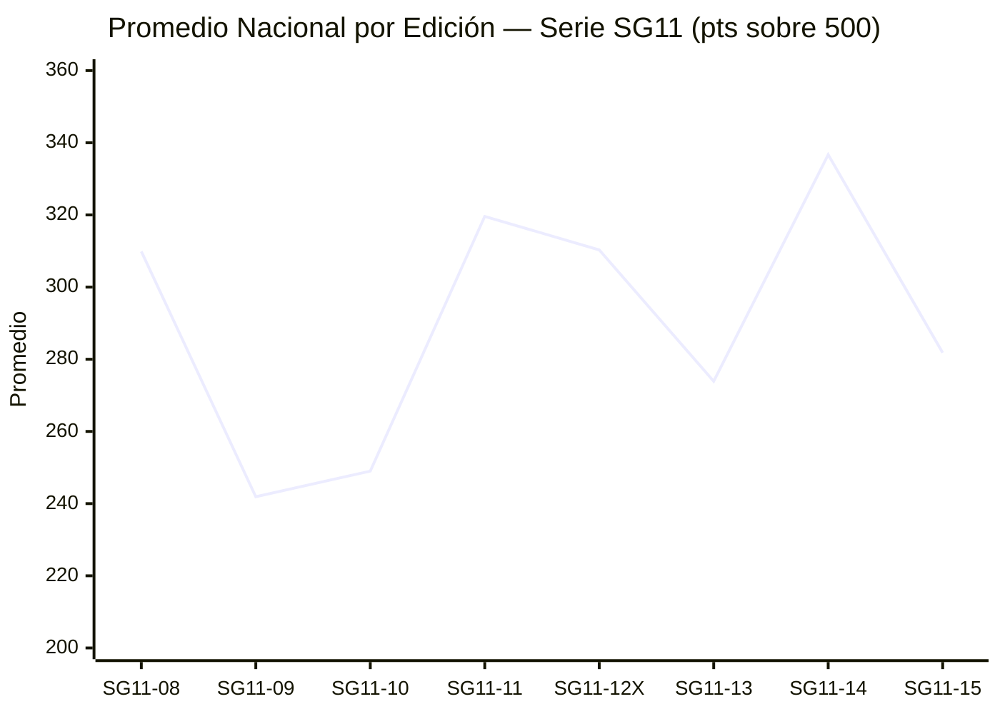
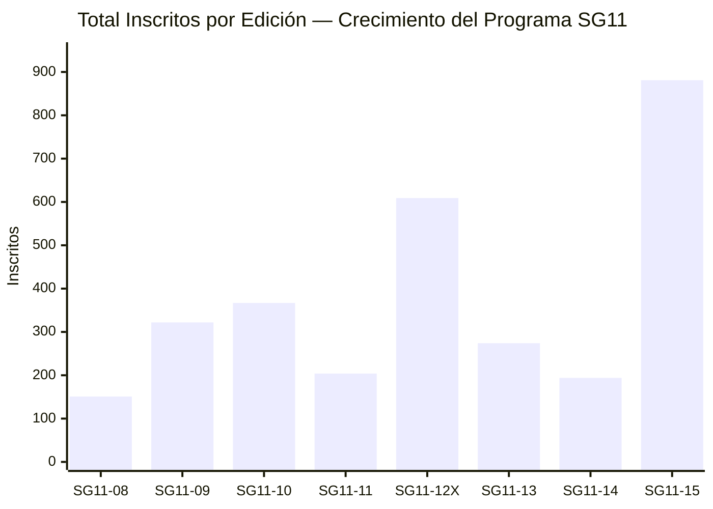
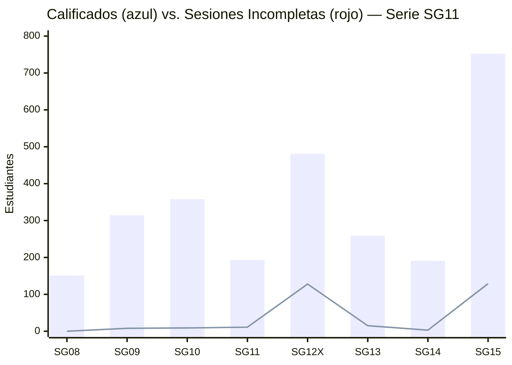

# ⚡ DASHBOARD EJECUTIVO — PROGRAMA SG11
### SeamosGenios · PreICFES Intensivo · Análisis Histórico Completo

> Generado `2026-04-18` · 8 Ediciones · SG11-08 → SG11-15 · Firestore ✅

---

## ╔══ TOTALES ACUMULADOS DEL PROGRAMA ══╗

```
┌─────────────────┬─────────────────┬─────────────────┬─────────────────┐
│   📚 SIMULACROS  │  👥 INSCRITOS   │  ✅ CALIFICADOS  │  ❌ INCOMPLETOS  │
│                 │                 │                 │                 │
│      8          │     3,002       │     2,499       │      303        │
│  ediciones      │   histórico     │   (83.2%)       │   (16.8%)       │
├─────────────────┼─────────────────┼─────────────────┼─────────────────┤
│  📈 PROMEDIO    │  🏆 MÁXIMO      │  📊 MEDIANA     │  💎 PUNTAJES    │
│   HISTÓRICO     │   HISTÓRICO     │   HISTÓRICA     │   PERFECTOS     │
│                 │                 │                 │                 │
│    290.4 pts    │   500 / 500     │    278 pts      │   ≥ 5 veces     │
│   sobre 500     │  (5 ediciones)  │   sobre 500     │  en el programa │
└─────────────────┴─────────────────┴─────────────────┴─────────────────┘
```

---

## ╔══ KPIs POR EDICIÓN — VISTA COMPLETA ══╗

```
┌──────────┬──────────┬──────────┬──────────┬──────────┬══════════╗═══════════┬──────────┐
│ EDICIÓN  │INSCRITOS │CALIFICAD.│INCOMPLET.│COMPLETUD │▌SG11-13 ▐│  SG11-14  │ SG11-15  │
├──────────┼──────────┼──────────┼──────────┼──────────┼══════════╣═══════════┼──────────┤
│ SG11-08  │   151    │   151    │    0     │  100% ★  │          │           │          │
│ SG11-09  │   322    │   314    │    8     │  97.5%   │          │           │          │
│ SG11-10  │   367    │   358    │    9     │  97.6%   │          │           │          │
│ SG11-11  │   204    │   193    │   11     │  94.6%   │          │           │          │
│ SG11-12X │   609    │   481    │   128    │  79.0% ⚠ │          │           │          │
│▌SG11-13 ▐│▌  274   ▐│▌  259   ▐│▌  15   ▐│▌ 94.5% ▐│          │           │          │
│ SG11-14  │   194    │   191    │    3     │  98.5% ✅│          │           │          │
│ SG11-15  │   881    │   752    │   129    │  85.4%   │          │           │          │
├──────────┼──────────┼──────────┼──────────┼──────────┤          │           │          │
│ TOTALES  │  3,002   │  2,499   │   303    │  83.2%   │          │           │          │
└──────────┴──────────┴──────────┴──────────┴──────────┴──────────┴───────────┴──────────┘
```

---

## ╔══ PROMEDIOS — PANEL DE RENDIMIENTO ══╗

```
┌──────────┬───────────────────────────────────────────────────┬────────┬────────┬────────┐
│ EDICIÓN  │  PROMEDIO SOBRE 500 (barra visual)                │  MÁX.  │  MED.  │  DES.  │
├──────────┼───────────────────────────────────────────────────┼────────┼────────┼────────┤
│ SG11-14  │ ████████████████████████████████████ 336.7 🥇     │  500   │  343   │  92.6  │
│ SG11-11  │ ████████████████████████████████████ 319.6        │  492   │  328   │  82.0  │
│ SG11-08  │ ███████████████████████████████████  309.9        │  461   │  315   │  70.4  │
│ SG11-12X │ ███████████████████████████████████  310.3        │  500   │  312   │  92.7  │
│────────── PROMEDIO HISTÓRICO ≈ 290 pts ──────────────────────────────────────────────── │
│ SG11-15  │ █████████████████████████████████    281.8        │  500   │ 258.5  │ 120.7  │
│▌SG11-13 ▐│▌████████████████████████████████   273.9 ←HOY ▐│▌500   ▐│▌257   ▐│▌104.4 ▐│
│ SG11-10  │ ████████████████████████████         249.0        │  470   │  231   │  84.5  │
│ SG11-09  │ ███████████████████████████          241.9 🔻     │  500   │ 218.5  │  90.7  │
└──────────┴───────────────────────────────────────────────────┴────────┴────────┴────────┘
```

> 🔴 **SG11-13 está 16.5 pts bajo el promedio histórico** — impulsado por INSECAP (107 avg) y Col. Integral Norte (147 avg)

---

## ╔══ GRÁFICO: EVOLUCIÓN DEL PROMEDIO ══╗



---

## ╔══ GRÁFICO: PARTICIPACIÓN TOTAL ══╗



---

## ╔══ GRÁFICO: CALIFICADOS vs. INCOMPLETOS ══╗



---

## ╔══ PANEL: SESIONES INCOMPLETAS ══╗

```
┌──────────┬─────────────┬───────────────────────────────────────┬──────────────┐
│ EDICIÓN  │ INCOMPLETOS │  TASA  │  SEMÁFORO    RIESGO           │  IMPACTO     │
├──────────┼─────────────┼────────┼───────────────────────────────┼──────────────┤
│ SG11-08  │      0      │  0.0%  │  🟢🟢🟢🟢🟢  CERO           │  Sin impacto │
│ SG11-14  │      3      │  1.5%  │  🟢🟢🟢🟢🟡  EXCELENTE      │  Mínimo      │
│ SG11-09  │      8      │  2.5%  │  🟢🟢🟢🟢🟡  MUY BUENO      │  Leve        │
│ SG11-10  │      9      │  2.5%  │  🟢🟢🟢🟢🟡  MUY BUENO      │  Leve        │
│ SG11-11  │     11      │  5.4%  │  🟢🟢🟢🟡🟡  ACEPTABLE      │  Moderado    │
│▌SG11-13 ▐│▌    15     ▐│▌ 5.5% ▐│ 🟢🟢🟢🟡🟡  ACEPTABLE ▐│  Moderado    │
│ SG11-15  │    129      │ 14.6%  │  🟠🟠🟠🟠🟠  PREOCUPANTE    │  Alto        │
│ SG11-12X │    128      │ 21.0%  │  🔴🔴🔴🔴🔴  CRÍTICO ⚠️    │  MUY ALTO    │
├──────────┼─────────────┼────────┼───────────────────────────────┼──────────────┤
│ TOTALES  │     303     │ 16.8%* │                               │              │
└──────────┴─────────────┴────────┴───────────────────────────────┴──────────────┘
  * Calculado sobre total de inscritos 3,002
```

---

## ╔══ PANEL: RÉCORDS HISTÓRICOS ══╗

```
┌─────────────────────────────────────┬──────────────┬────────────────┐
│  CATEGORÍA                          │   EDICIÓN    │     VALOR      │
├─────────────────────────────────────┼──────────────┼────────────────┤
│  🥇 Mayor promedio nacional         │  SG11-14     │   336.7 pts    │
│  🔻 Menor promedio nacional         │  SG11-09     │   241.9 pts    │
│  👥 Mayor participación             │  SG11-15     │  881 inscritos │
│  👤 Menor participación             │  SG11-08     │  151 inscritos │
│  ✅ Mejor completud (0 incompletos) │  SG11-08     │   100.0%       │
│  ❌ Peor completud                  │  SG11-12X    │    79.0%       │
│  📏 Grupo más homogéneo (σ bajo)    │  SG11-08     │  σ = 70.4      │
│  🌐 Grupo más heterogéneo (σ alto)  │  SG11-15     │  σ = 120.7     │
│  🎯 Mediana más alta                │  SG11-14     │   343 pts      │
│  📉 Mediana más baja                │  SG11-09     │  218.5 pts     │
│  💎 Puntaje perfecto 500/500        │  ≥5 edicions │   500 pts      │
├─────────────────────────────────────┼──────────────┼────────────────┤
│  📌 Posición SG11-13 en el ranking  │  Puesto 6/8  │  273.9 pts     │
└─────────────────────────────────────┴──────────────┴────────────────┘
```

---

## ╔══ CUADRANTE ESTRATÉGICO ══╗

```mermaid
quadrantChart
    title Participacion vs Promedio — Posicion Estrategica por Edicion SG11
    x-axis "Pocos Participantes" --> "Muchos Participantes"
    y-axis "Promedio Bajo" --> "Promedio Alto"
    quadrant-1 Masivo y Eficiente
    quadrant-2 Selectivo y Excelente
    quadrant-3 Pequeno y Bajo Rendimiento
    quadrant-4 Masivo con Bajo Rendimiento
    SG11-08: [0.05, 0.73]
    SG11-09: [0.24, 0.05]
    SG11-10: [0.28, 0.08]
    SG11-11: [0.07, 0.83]
    SG11-12X: [0.62, 0.73]
    SG11-13: [0.16, 0.35]
    SG11-14: [0.06, 0.97]
    SG11-15: [1.0, 0.43]
```

| Cuadrante | Ediciones | Interpretación |
|-----------|-----------|----------------|
| 🟢 **Q2 — Selectivo y Excelente** | SG11-08, SG11-11, SG11-14 | Grupo pequeño, alto rendimiento. Modelo ideal |
| 🔵 **Q1 — Masivo y Eficiente** | SG11-12X | Escala grande + buen promedio. Logro difícil |
| 🟡 **Q4 — Masivo Bajo Rendimiento** | SG11-15 | La masificación diluyó la calidad |
| 🟠 **Q3-Q2 Frontera** | **SG11-13** | Grupo mediano, promedio bajo. Señal de alerta |

---

## ╔══ ANÁLISIS DE CICLOS Y TENDENCIAS ══╗

```
CICLO ZIGZAG HISTÓRICO:
═══════════════════════════════════════════════════════════════════════
SG08 (309.9) ↓  SG09 (241.9) ↑  SG10 (249.0) ↑  SG11 (319.6) ↓
SG12X(310.3) ↓  SG13 (273.9) ↑  SG14 (336.7) ↓  SG15 (281.8)

REBOTES CONFIRMADOS:
  • SG09→SG11: +77.7 pts de recuperación (2 ediciones)
  • SG13→SG14: +62.8 pts de recuperación (1 edición) ← YA OCURRIÓ

PREDICCIÓN SG11-16:
  Basada en patrón histórico: SUBIDA esperada respecto a SG11-15
  Estimado: 295 – 315 pts (si participación se mantiene ~300 estudiantes)
═══════════════════════════════════════════════════════════════════════
```

---

## ╔══ ACUMULADO SG11-13: POSICIÓN EN EL PROGRAMA ══╗

```
┌──────────────────────────────────────────────────────────────────────┐
│            SG11-13 — TARJETA DE POSICIÓN EN EL PROGRAMA              │
├──────────────────────────────────────────────────────────────────────┤
│                                                                      │
│  Promedio:   273.9 pts    │  Ranking promedio:    6° de 8  (📉 bajo) │
│  Inscritos:  274          │  Ranking tamaño:      5° de 8  (medio)   │
│  Calificad.: 259 (94.5%)  │  Ranking completud:   4° de 8  (bueno)   │
│  Incomplet.: 15 (5.5%)    │  Ranking incompletos: 4° de 8  (aceptab) │
│  Máximo:     500 pts ★    │  Puntaje perfecto:    SÍ ✅               │
│  Mínimo:     35 pts       │  Rango de scores:     465 pts de amplitud│
│  Mediana:    257 pts      │  Sesgo:               +16.9 (positivo)   │
│  Desv. Est.: 104.4        │  Homogeneidad:        Baja (σ alto)       │
│                                                                      │
│  vs. PROMEDIO HISTÓRICO (290.4):  ▼ -16.5 pts  (5.7% bajo histórico)│
│  vs. MEJOR EDICIÓN (SG11-14):     ▼ -62.8 pts                        │
│  vs. PEOR EDICIÓN  (SG11-09):     ▲ +32.0 pts  (mejor que el mínimo)│
│                                                                      │
│  DIAGNÓSTICO: Edición de TRANSICIÓN — Incorporación de nuevas IEDs  │
│  con perfiles bajos arrastra el promedio nacional hacia abajo        │
└──────────────────────────────────────────────────────────────────────┘
```

---

## ╔══ PANEL: INSTITUCIONES SG11-13 vs. MEDIA NACIONAL ══╗

```
┌─────────────────────────────┬────────┬────────┬─────────┬────────────────┐
│ INSTITUCIÓN                 │   N    │  AVG   │  ΔMedia │  POSICIÓN      │
├─────────────────────────────┼────────┼────────┼─────────┼────────────────┤
│ PREICFES SEAMOSGENIOS       │   99   │ 319.0  │ +45.1 ▲ │ 🟢 SOBRE MEDIA │
│ INDIVIDUAL (Proy. Sec.)     │  113   │ 276.8  │  +2.9 ▲ │ 🟢 SOBRE MEDIA │
│ ── MEDIA NACIONAL 273.9 ───────────────────────────────────────────── │
│ IETAC                       │   32   │ 194.8  │ -79.1 ▼ │ 🟡 BAJO MEDIA  │
│ COLEGIO INTEGRAL DEL NORTE  │    6   │ 147.2  │ -126.7▼ │ 🔴 MUY BAJO    │
│ INSECAP                     │    9   │ 107.4  │ -166.5▼ │ 🆘 CRÍTICO     │
├─────────────────────────────┼────────┼────────┼─────────┼────────────────┤
│ TOTAL NACIONAL              │  259   │ 273.9  │    —    │                │
└─────────────────────────────┴────────┴────────┴─────────┴────────────────┘
```

---

## ╔══ SESIONES INCOMPLETAS SG11-13 — DETALLE ══╗

```
TOTAL AFECTADOS: 15 estudiantes │ Todas presentaron solo S1, faltó S2 (salvo 1)

┌────┬─────────────┬────────────────────────────────────────────┬─────────────┬──────┐
│ #  │     ID      │ ESTUDIANTE                                 │ INSTITUCIÓN │ FALTA│
├────┼─────────────┼────────────────────────────────────────────┼─────────────┼──────┤
│  1 │ 1104424528  │ NICOLL AGULO OROZCO                        │ INSECAP     │  S1  │
│  2 │ 1148438017  │ MARIANA DE JESUS CABADIA PARRA             │ IETAC       │  S2  │
│  3 │ 1133790838  │ LUIS DANIEL MENDOZA URIBE                  │ IETAC       │  S2  │
│  4 │ 1113784979  │ JUAN FELIPE MONTOYA ARANGO                 │ INDIVIDUAL  │  S2  │
│  5 │ 1075793667  │ MARIA DE LOS ANGELES MALDONADO GONZALEZ   │ INDIVIDUAL  │  S2  │
│  6 │ 1144724080  │ JEISON STIVEN COLLAZOS AUDOR               │ INDIVIDUAL  │  S2  │
│  7 │ 1093656034  │ MARIA ISABEL AFANADOR JAIMES               │ PREICFES SG │  S2  │
│  8 │ 1012379291  │ FELIPE AREVALO POLO                        │ PREICFES SG │  S2  │
│  9 │ 1104415290  │ KENDYS PAOLA FLOREZ MONTALVO               │ INSECAP     │  S2  │
│ 10 │ 1148695719  │ MARIANA GRANDA CARDENAS                    │ INSECAP     │  S2  │
│ 11 │ 1032253397  │ KELLY JOHANA BALLESTEROS PESCADOR          │ INSECAP     │  S2  │
│ 12 │ 1104425638  │ VALERIA SOFIA VILLALBA SANCHEZ             │ INSECAP     │  S2  │
│ 13 │ 1043309950  │ EMMANUEL OSORIO AGUILAR                    │ COL. INT. N │  S2  │
│ 14 │ 1142930023  │ SANTIAGO HERNAN GARCIA MARTINEZ            │ COL. INT. N │  S2  │
│ 15 │ 1201220373  │ PAZ ALEXANDRA AVENDANO FERNANDEZ           │ COL. INT. N │  S2  │
└────┴─────────────┴────────────────────────────────────────────┴─────────────┴──────┘

Por institución:  INSECAP (5) │ COL. INTEGRAL NORTE (3) │ INDIVIDUAL (3) │
                  PREICFES SG (2) │ IETAC (2)
```

---

## ╔══ PLAN DE ACCIÓN — PRIORIDADES ══╗

```
┌────────────────────────────────────────────────────────────────────┐
│  🔴 PRIORIDAD ALTA — ACCIÓN INMEDIATA                              │
├────────────────────────────────────────────────────────────────────┤
│  • Contactar 15 estudiantes con sesión incompleta                  │
│  • Reunión urgente coordinadores INSECAP y Col. Integral Norte     │
│  • Plan de refuerzo Ciencias Naturales (mediana: 44/100 🆘)        │
└────────────────────────────────────────────────────────────────────┘
┌────────────────────────────────────────────────────────────────────┐
│  🟡 PRIORIDAD MEDIA — PRÓXIMAS 2 SEMANAS                           │
├────────────────────────────────────────────────────────────────────┤
│  • Taller intensivo por áreas para IEDs bajo la media              │
│  • Definir umbral mínimo institucional (propuesta: 200 pts avg)    │
│  • Investigar causas del 21% incompletos en SG11-12X para evitar  │
│    repetición en ediciones masivas                                  │
└────────────────────────────────────────────────────────────────────┘
┌────────────────────────────────────────────────────────────────────┐
│  🟢 PRIORIDAD BAJA — LARGO PLAZO                                   │
├────────────────────────────────────────────────────────────────────┤
│  • Dashboard de tendencias históricas para coordinadores           │
│  • Indicador "salud institucional" por 3 simulacros consecutivos   │
│  • Meta SG11-16: superar 290 pts (promedio histórico del programa) │
└────────────────────────────────────────────────────────────────────┘
```

---

## ╔══ RESUMEN EJECUTIVO FINAL ══╗

```
═══════════════════════════════════════════════════════════════════════
  PROGRAMA SG11  │  8 EDICIONES  │  3,002 INSCRITOS  │  2,499 VÁLIDOS
───────────────────────────────────────────────────────────────────────
  Promedio histórico: 290.4 pts   │   Total incompletos histórico: 303
  Mejor edición:  SG11-14 (336.7) │   Mayor grupo: SG11-15 (881 est.)
  Edición actual: SG11-13 (273.9) │   16.5 pts bajo el promedio hist.
  Próxima edición:SG11-14 →336.7  │   YA CONFIRMADO el rebote ✅
═══════════════════════════════════════════════════════════════════════
```

---

*📌 SeamosGenios · PreICFES Intensivo · Reporte Histórico Ejecutivo*
*🔒 Uso exclusivo para coordinadores y administradores*
